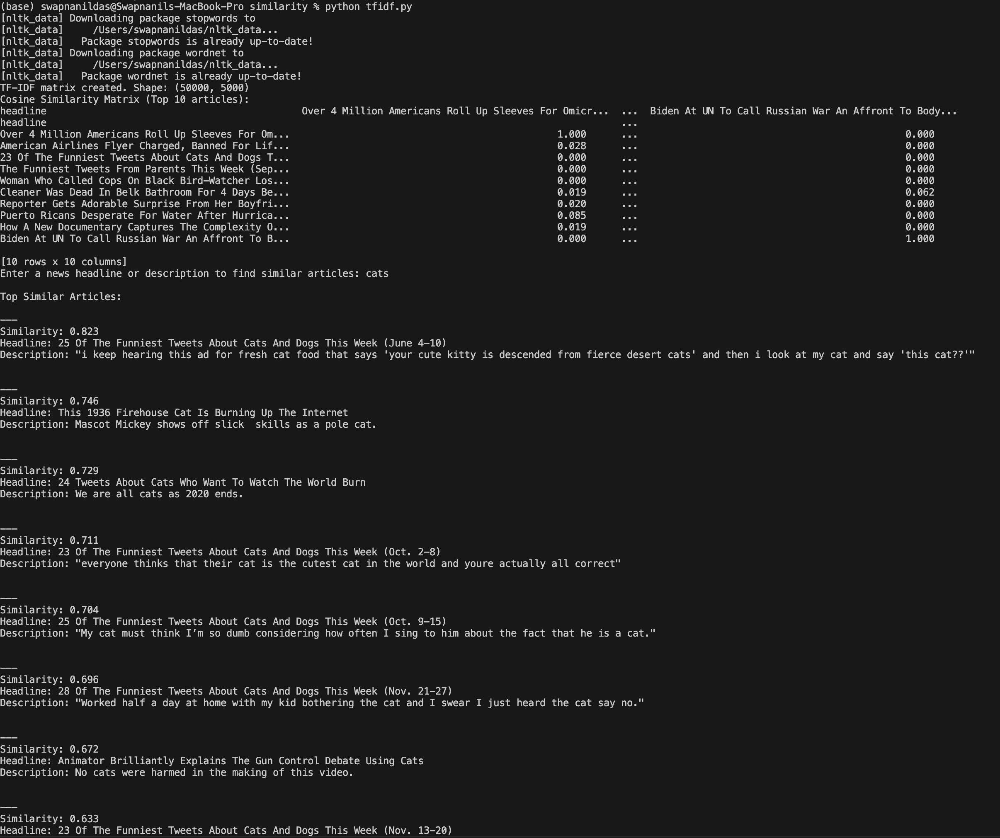

# 📰 News Article Similarity Project

A lightweight Python project that measures how similar news articles are using TF-IDF vectorization. Designed to be simple, clear, and easy to extend for future text analysis work.

## 🌟 Overview

This project computes similarity scores between news articles using TF-IDF. It helps identify which articles overlap in content or topic. Useful for NLP beginners or anyone building a similarity engine.

## 📁 Project Structure

```
similarity/
│── tfidf.py
│── tfidf_similarity.py
│── data/
│     ├── article1.txt
│     ├── article2.txt
│     └── ...
│── requirements.txt
└── README.md
```

## ⚙️ Features

- Converts articles into TF-IDF vectors  
- Computes cosine similarity  
- Simple function-based architecture  
- Easy to extend with more preprocessing or larger datasets  

## 🚀 How to Run

### 1. Install dependencies

```
pip install -r requirements.txt
```

### 2. Run the similarity script

```
python3 tfidf.py
```

### 3. Output

The script displays similarity scores between articles and highlights the most similar pairs.
Below is the sample output generated by the TF-IDF similarity script:



## 📦 Requirements

Add these into `requirements.txt`:

```
scikit-learn
nltk
numpy
```

If NLTK stopwords fail due to SSL:

```
python3 -m nltk.downloader stopwords wordnet
```

## 🧠 How It Works

1. Loads text files  
2. Preprocesses content  
3. Converts text to TF-IDF vectors  
4. Computes cosine similarity  
5. Outputs similarity matrix and closest matches  

## 📌 Use Cases

- Detecting duplicate or highly similar news items  
- Clustering similar stories  
- News recommendation engines  
- Media monitoring or journalism research  

## 🔧 Customization

You can extend the project by:

- Adding stemming or lemmatization  
- Switching to spaCy for preprocessing  
- Including URL scraping  
- Visualizing cluster groups with PCA  

## 🗂️ Dataset

Store all `.txt` files inside the `data/` directory.

## 🤝 Contributing

Open to pull requests, ideas, or feature suggestions.

## 📜 License

MIT License.

## 💬 Contact

If you want help turning this into a web app or adding clustering, feel free to ask.
